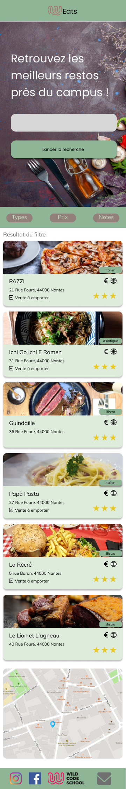
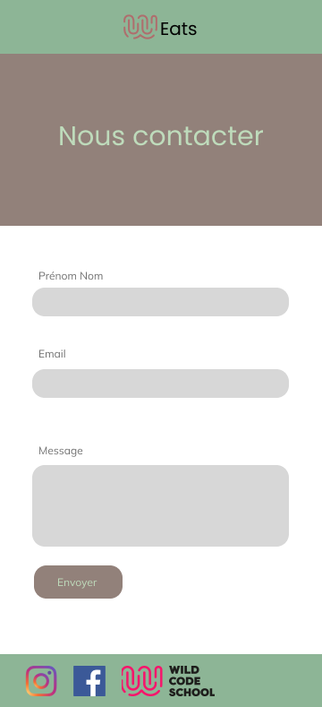
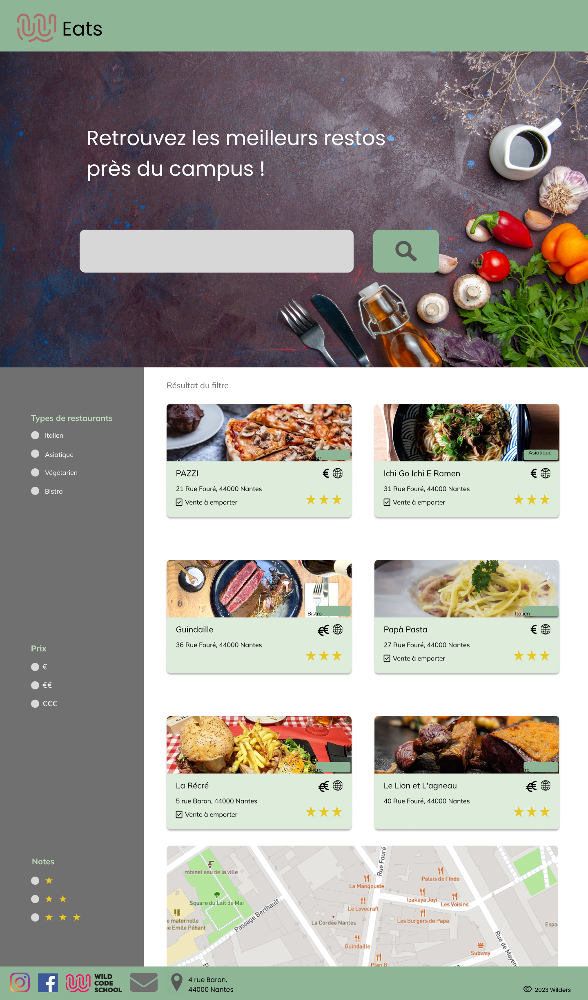
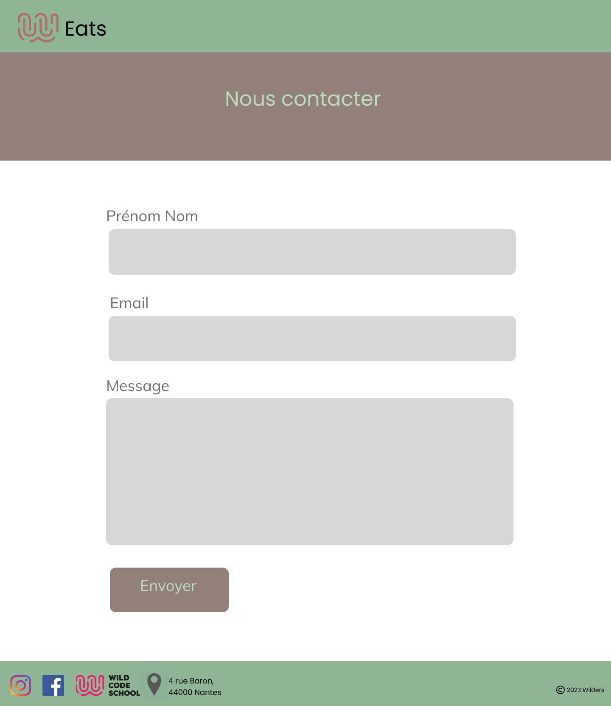

# Wild-Eats 🥩🍽️

This is a website to help the wilders identify the restaurants near the campus.

> _Il s'agit d'un site web pour aider les wilders à trouver des restaurants près du campus._

## Goal / Objectif 🎯

There is a **list of restaurants** and their information displayed with cards.\
A card contains the **name of the restaurant**, the **type of food**, the **price**, the **reviews**, a **picture of the restaurant**, the **possible takeaway option**, the **location** and the **link to the website** of the restaurant.\ 
There is a **search bar** where one can type the name of the restaurant you are looking for.\
There are **filters** to sort the restaurants by type of food, price, and reviews.\
There is a map to see the location of the restaurants.

> _Il y a une **liste de restaurants** et leurs informations affichées avec des cartes._\
> _Une carte contient le **nom du restaurant**, le **type de nourriture**, le **prix**, les **avis**, une **photo du restaurant**, l'**option à emporter**, l'**adresse** et le **lien vers le site web** du restaurant._\
> _Il y a une **barre de recherche** où l'on peut taper le nom du restaurant que l'on recherche._\
> _Il y a des **filtres** pour trier les restaurants par type de nourriture, prix et avis._\
> _Il y a une carte pour voir l'emplacement des restaurants._

## Front-end Style Guide / Guide de style front-end 🧑🏽‍💻

### Design / Conception

The designs were created to the following widths:

- Mobile: 360px
- Desktop: 1440px

The site was designed with: 

> _Les designs ont été créés aux largeurs suivantes :_
>
> - _Mobile : 360px_
> - _Desktop : 1440px_
>
> _Le design du site a été conçu avec :_ 

### Colors / Couleurs

- Primary: #8DB596
- Secondary: #92817A
- Tertiary: #BEDBBB
- Quaternary: #707070

> - _Primaire : #8DB596_\
> - _Secondaire : #92817A_\
> - _Tertiaire : #BEDBBB_\
> - _Quaternaire : #707070_

### Typography / Typographie 🆎

- Title: `font-family: 'Poppins', sans-serif;`
- Body: `font-family: 'Mulish', sans-serif;`

> - _Titre : `font-family: 'Poppins', sans-serif;`_\
> - _Corps : `font-family: 'Mulish', sans-serif;`_

## Overview / Aperçu

### Screenshots / Captures d'écran

#### Mobile / Mobile

#### Desktop / Bureau

### Links / Liens

Github pages link of the website: [Wild Eats](https://ange230700.github.io/wild-eats/)

> _Lien de la page Github du site web :_ [Wild Eats](https://ange230700.github.io/wild-eats/)

## Our process / Notre démarche

### Powered by / Créé avec

## Authors / Auteurs | 

- [Akane FUKUI](https://github.com/akhmm)
- [Caroline GALLIX](https://github.com/CarolineG85)
- [Sissis UI](https://github.com/sissis02)
- [Karim REJANI](https://github.com/karimrjn)
- [Ange KOUAKOU](https://github.com/Ange230700)
